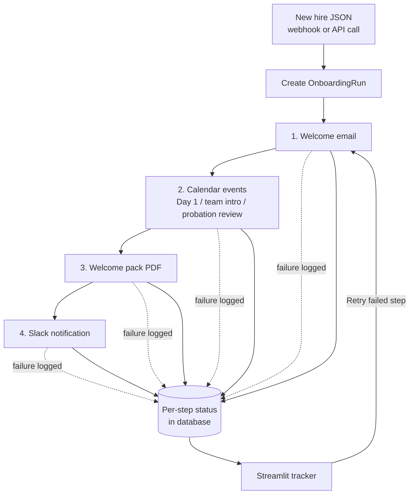

# Trinops Onboarding

Every new hire triggers the same handful of manual steps — welcome email, calendar invites,
welcome pack, team announcement — done identically each time. This service runs them
automatically from a single trigger, logs every step, and lets you retry anything that fails.

## The problem

Onboarding a new starter usually means someone manually:

- writing a welcome email,
- creating three or four calendar events,
- putting together a welcome pack,
- posting a "say hi to..." message in the team channel.

It's repetitive, easy to half-finish, and when one step is missed nobody notices until the
new hire's first day. This service does all of it from one webhook or API call, and makes
every step's status visible so nothing is silently dropped.

## How it works



**Fault-tolerant by design.** Each step runs independently. A step that raises is recorded
as `FAILED` with its error message — it does not abort the run or undo earlier steps. The run
finishes `COMPLETED` (all steps passed), `PARTIAL` (some failed) or `FAILED` (all failed), and
any failed step can be retried on its own from the tracker.

### The four steps

1. **Welcome email** — personalised HTML email (Jinja2) sent via Gmail
2. **Calendar events** — three Google Calendar events per hire: Day 1 induction, team intro,
   and a probation review at `start_date + PROBATION_PERIOD_DAYS`
3. **Welcome pack PDF** — WeasyPrint renders a branded pack: hire details, first-week
   schedule, key contacts
4. **Slack notification** — a team-channel announcement via the Slack Web API

### Tracker

A Streamlit app lists every onboarding run, breaks each into its steps with pass/fail
indicators and attempt counts, and shows a **Retry** button next to any failed step. New
onboardings can also be triggered straight from the sidebar.

## Quick start (demo mode)

No Google account, no Slack workspace, no API keys — just Docker:

```bash
docker compose up --build
```

- **API + docs:** <http://localhost:8000/docs>
- **Tracker:** <http://localhost:8501>

Demo mode seeds three new hires and runs onboarding for each on startup. Emails, calendar
events and Slack messages are written to `data/` as files instead of being sent:

- emails and Slack messages → `data/outbox/`
- calendar events → `data/calendar/`
- welcome pack PDFs → `data/welcome_packs/`

By default `DEMO_FLAKY_STEPS=["slack_notification"]`, so each seeded run ends **PARTIAL** with
the Slack step failed — open the tracker and click **Retry** to watch it go green. Set
`DEMO_FLAKY_STEPS=[]` in `.env` for clean runs.

## Running tests

```bash
python -m venv .venv && source .venv/bin/activate
pip install -r requirements.txt
pytest
```

WeasyPrint needs native libraries (Pango). On macOS: `brew install pango`. On Debian/Ubuntu
they are already in the Dockerfile.

## Going live

1. Copy `.env.example` to `.env` and set `DEMO_MODE=false`
2. Create a Google Cloud project, enable the Gmail and Calendar APIs, download OAuth
   credentials as `credentials.json`, and complete the OAuth flow to produce `token.json`
3. Create a Slack app with `chat:write`, install it, and set `SLACK_BOT_TOKEN` and
   `SLACK_CHANNEL`
4. Set company details, contacts and probation period in `.env`
5. Point your HR system's "new hire" webhook at `POST /onboarding/trigger`
6. Swap SQLite for PostgreSQL by changing `DATABASE_URL` — the models are SQLAlchemy 2.0 and
   carry over unchanged

## API

| Method | Path | Purpose |
|---|---|---|
| POST | `/onboarding/trigger` | Run onboarding for a new hire |
| GET | `/onboarding` | List all runs (newest first) |
| GET | `/onboarding/{id}` | Inspect one run and its steps |
| POST | `/onboarding/{id}/retry/{step}` | Retry one failed step |
| GET | `/health` | Liveness check |

Trigger payload:

```json
{
  "name": "Alex Example",
  "role": "Operations Analyst",
  "email": "alex.example@company-a.example.com",
  "start_date": "2026-07-01",
  "slack_handle": "@alex.example",
  "manager_name": "Morgan Example"
}
```

Interactive docs at <http://localhost:8000/docs>.

## Project structure

```
onboarding/
  workflow.py            # orchestrates the steps, logs per-step status, handles retry
  email_sender.py        # welcome email rendering
  calendar_events.py     # builds + creates the three calendar events
  document_generator.py  # welcome pack PDF (WeasyPrint + Jinja2)
  slack_notifier.py      # team Slack notification
  notifier.py            # Gmail / outbox email backend
  models.py              # Employee, OnboardingRun, OnboardingStep
  seed_loader.py         # demo: seed hires + run onboarding on first start
api/                     # FastAPI app + onboarding routes
tracker/                 # Streamlit run tracker (retry per failed step)
templates/               # Jinja2: welcome email, welcome pack
seed/                    # demo hires (Example-style names, nothing real)
tests/                   # pytest: workflow, fault tolerance, retry, PDF
```

## Tech stack

FastAPI · SQLAlchemy 2.0 · SQLite (PostgreSQL-ready) · Gmail API · Google Calendar API ·
Slack Web API · WeasyPrint · Jinja2 · Streamlit · pytest · Docker

No Claude API calls — onboarding is pure orchestration, so there is nothing to extract or
classify. The value here is reliability and visibility, not AI.
